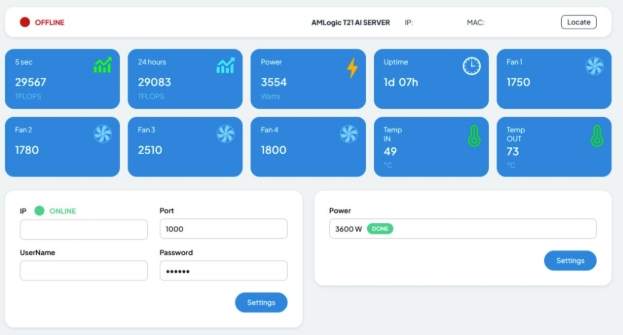
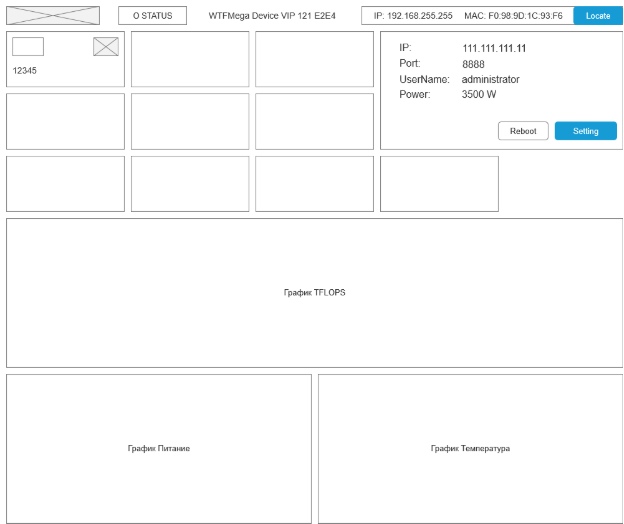
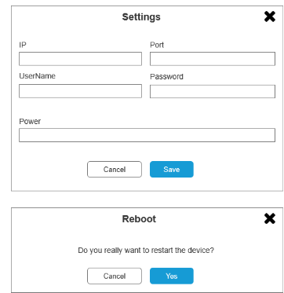

Syndicate Investing Mining

Страница, с возможностью просматривать статистику работы и менять данные устройства.

**Шрифты** – лицензия не важна, написание только латиницей.

**Пожелание по цветам** – копию референса делать не надо, надо чтобы отличалось. Всё в ТЕМНЫХ цветах. 

Ширина экрана:

- Десктоп	>=1200 px
- Планшет	от 576px до 1199px.
- Телефон	<576px

Референс:

**Прототип страницы:**

**Модальные окна:**

 Do you really want to restart the device?

**OFFLINE** \ ONLINE – статус устройства, доступно оно или нет (красный / зеленый).

**AMLogic T21 AI SERVER** – это название устройства, например **WTFMega Device VIP 121 E2E4**

**IP** – например, 192.168.0.1

**MAC** – например, F0:98:9D:1C:93:F6

**Locate** – кнопка, отправляет данные локали (возможно позднее понадобится статус отправки, или модальное окно в случае ошибки).

10 плашек с иконками:

|**Надпись**|**Ед. измер-ия**|**Описание**|**Комментарий**|
| :- | :- | :- | :- |
|10 sec|TFLOPS|Выработка мощности за 10 сек.||
|24 hours|TFLOPS|Выработка мощности за 24 часа||
|Power|Watts|Потребление электричества||
|Uptime||Время не прерывной работы устройства||
|Fan 1||Скорость вращения вентилятора||
|Fan 2||Скорость вращения вентилятора||
|Fan 3||Скорость вращения вентилятора||
|Fan 4||Скорость вращения вентилятора||
|Temp IN|°C|Температура||
|Temp OUT|°C|Температура||
|Reboot||Кнопка перезагрузки устройства. При нажатии, должно сначала показываться простое окно, с двумя кнопками. Yes \ Cancel|Нет в референсе!|

**Блок** IP \ Port \ UserName \ Password \ Setting
Setting  - кнопка отправляет данные на устройство (возможно позднее понадобится статус отправки, или модальное окно в случае ошибки).

**Блок** Power \ Setting
Setting  - кнопка отправляет данные на устройство (возможно позднее понадобится статус отправки, или модальное окно в случае ошибки).

**График работы**

|Заголовок|24 hours (TFLOPS)|
| :- | :- |
|Производительность|0 / 7000 / 14000 / 21000 / 28000 / 35000|
|На 15 дней|01 Apr / 02 Apr / 03 Apr / 04 Apr / 05 Apr / 06 Apr / 07 Apr / 08 Apr / 09 Apr / 10 Apr / 11 Apr / 12 Apr / 13 Apr / 14 Apr / 15 Apr|

Для построения и вывода данных графика будет использоваться библиотека Chart.js

Примеры построения:

1. <https://www.chartjs.org/docs/latest/samples/line/line.html>
1. <https://www.chartjs.org/docs/latest/samples/line/multi-axis.html>
1. <https://www.chartjs.org/docs/latest/samples/line/point-styling.html>
1. <https://www.chartjs.org/docs/latest/samples/title/alignment.html> 

Примеры UX китов которые можно взять за основу:

1. Bootstrap
   <https://www.figma.com/community/file/876022745968684318> 
1. Chakra UI <https://www.figma.com/community/search?resource_type=mixed&sort_by=relevancy&query=chakra+ui&editor_type=all&price=all&creators=all>
1. <https://ui8.net/category/freebies> 
1. Сообщество Figma
   <https://www.figma.com/community/search?resource_type=mixed&sort_by=all_time&query=ui+kit&editor_type=all&price=all&creators=all>
1. Eve UI Kit

   <https://www.figma.com/community/file/1196321663851018536>

1. Taiga
   <https://www.figma.com/community/file/1220308188005380608>

UX киты и дизайн системы:

1. <https://fluent2.microsoft.design/get-started/design>
1. <https://consta.design/> 
1. <https://design.rusatom.dev/>
#
# Разное
**Данные** на странице должны обновляться каждые 10 секунд.

*Предусмотреть*: 
Если **нет данных** на странице, то вместо цифр выводятся прочерки.
Если статус OFFLINE - то все кнопки делаем не активными.

